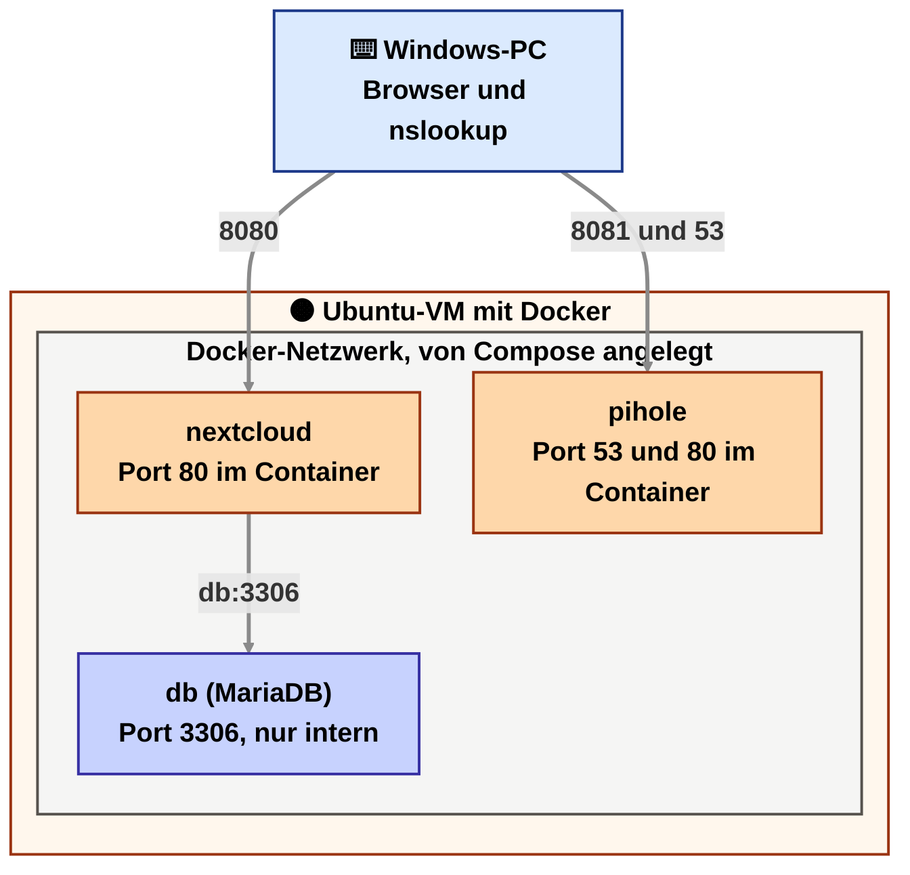
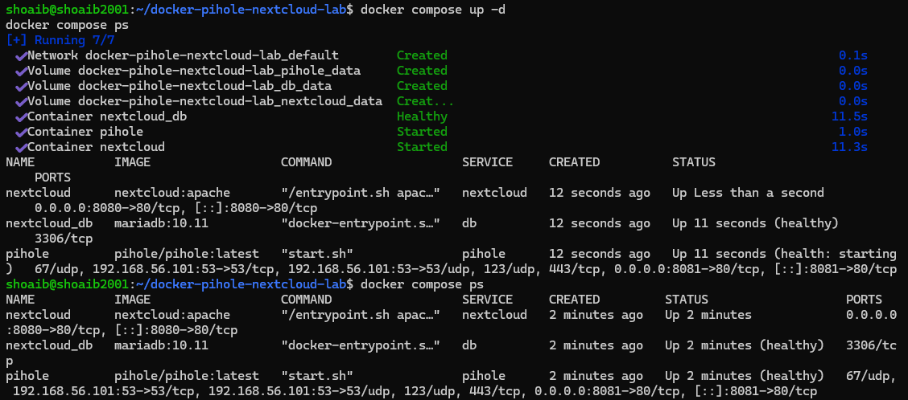
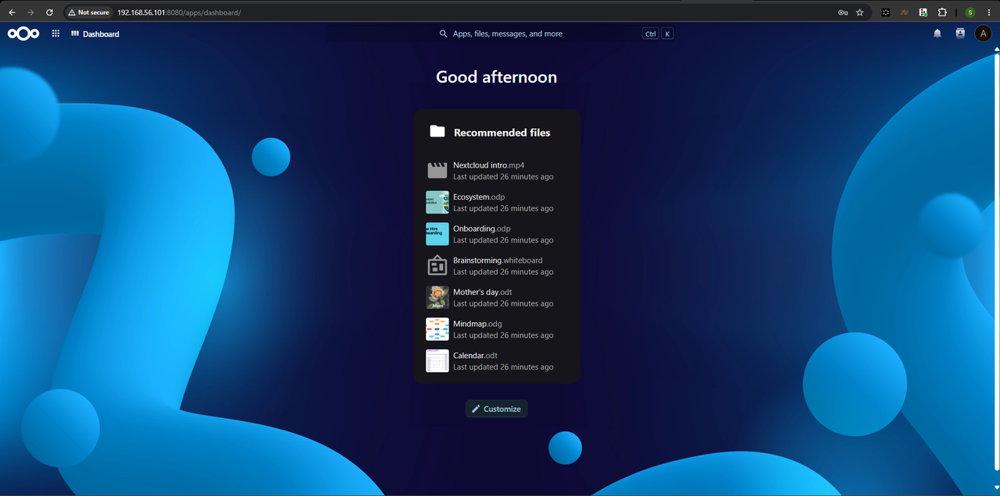
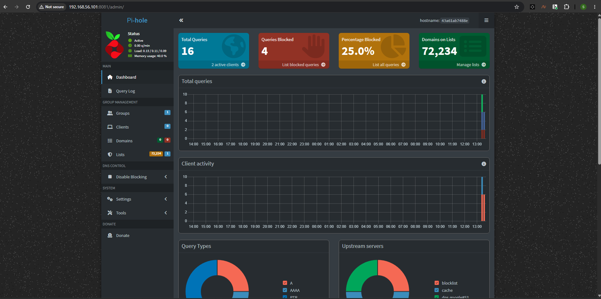
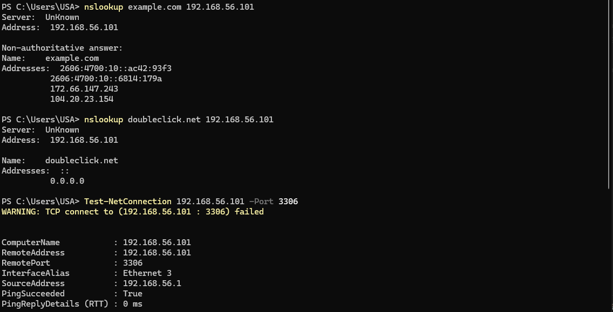
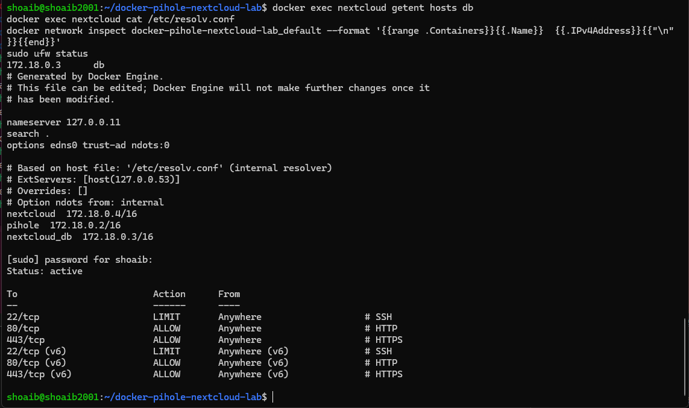
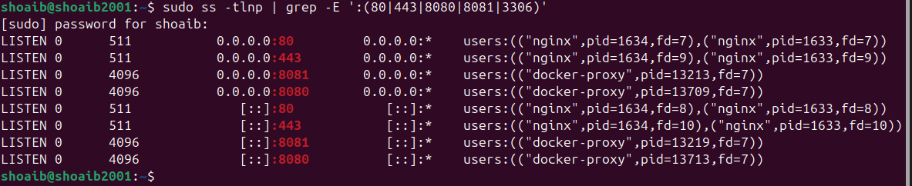
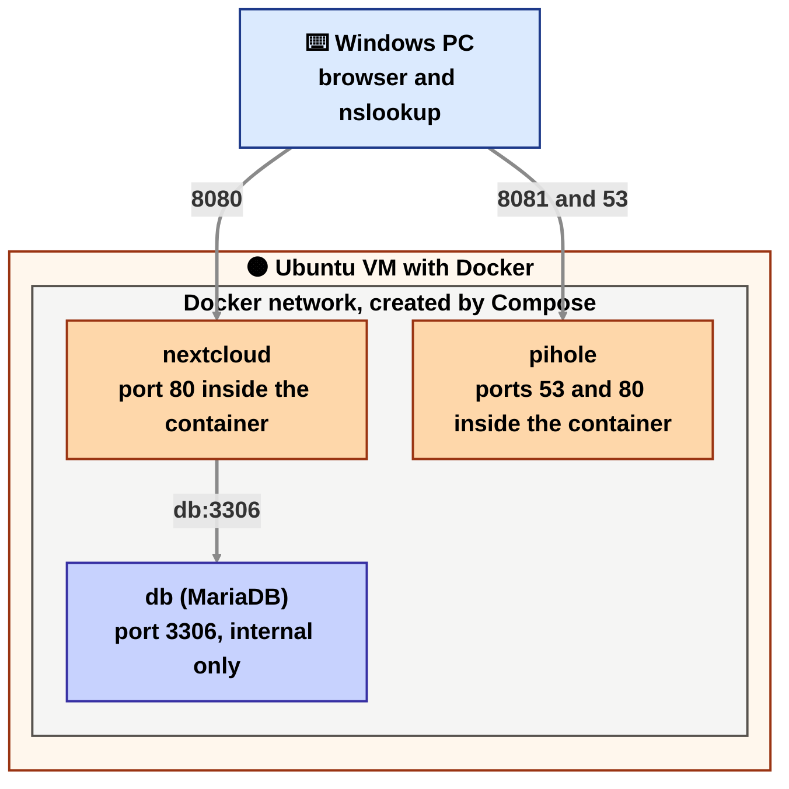

# Docker-Lab: Pi-hole und Nextcloud

Sprache wählen / Choose a language

<details open name="language">
<summary><b>Deutsch</b></summary>

Das ist ein kleines Lernprojekt. Mit einer `docker-compose.yml` starte ich drei Container auf meiner Ubuntu-VM: Pi-hole (ein DNS-Werbeblocker), Nextcloud (eine eigene Cloud für Dateien) und eine MariaDB-Datenbank für Nextcloud. Ich wollte verstehen, wie Container miteinander reden und was dabei schiefgehen kann. Typische Probleme und ihre Lösungen stehen in der [Fehlersuche](docs/troubleshooting.md).

## Was läuft

| Container | Image | Wofür | Erreichbar unter |
|---|---|---|---|
| pihole | pihole/pihole | blockiert Werbe- und Tracking-Domains per DNS | Admin-Seite `http://VM-IP:8081/admin`, DNS auf Port 53 |
| nextcloud | nextcloud:apache | eigene Cloud für Dateien | `http://VM-IP:8080` |
| db | mariadb:10.11 | Datenbank für Nextcloud | nur intern, kein Port nach außen |

## Wie die Container zusammenhängen



Von außen sind nur die Ports 8080 (Nextcloud), 8081 (Pi-hole-Seite) und 53 (DNS) erreichbar. Die Datenbank hat keinen Port nach außen. Nextcloud findet sie über den Namen `db`.

## Starten

Voraussetzung: eine Ubuntu-VM mit Host-only-Adapter. Die Adresse zeigt `ip -br a`, zum Beispiel `192.168.56.101`.

Tipp: Vorher in VirtualBox einen Snapshot der VM machen (Machine, Take Snapshot). Docker legt eigene Netzwerkregeln an und belegt Ports. Mit dem Snapshot komme ich leicht zum alten Zustand zurück.

1. Docker installieren.

   ```bash
   sudo apt update
   sudo apt install -y docker.io docker-compose-v2 git
   sudo usermod -aG docker $USER
   ```

   Danach ab- und wieder anmelden, damit `docker` ohne `sudo` funktioniert.

2. Das Projekt holen.

   ```bash
   git clone https://github.com/shoaib-abdul-haleem/docker-pihole-nextcloud-lab.git
   cd docker-pihole-nextcloud-lab
   ```

3. Die Einstellungen anlegen. In `.env` die eigene VM-Adresse bei `HOST_IP` eintragen und die Passwörter ändern.

   ```bash
   cp .env.example .env
   nano .env
   ```

4. Starten.

   ```bash
   docker compose up -d
   docker compose ps
   ```

   Beim ersten Start lädt Docker die Images herunter. Wie lange das dauert, hängt von der Internetverbindung ab. Hängt der Download, steht in der [Fehlersuche](docs/troubleshooting.md) unter Punkt 9, was bei mir geholfen hat. Danach braucht Nextcloud noch etwa eine Minute für die Einrichtung. `docker compose logs -f nextcloud` zeigt den Fortschritt.

5. Ausprobieren.

   - Nextcloud im Browser öffnen: `http://192.168.56.101:8080`. Anmelden mit dem Admin-Konto aus der `.env`.
   - Pi-hole öffnen: `http://192.168.56.101:8081/admin`.
   - In Windows PowerShell zwei DNS-Abfragen über Pi-hole stellen:

     ```powershell
     nslookup example.com 192.168.56.101
     nslookup doubleclick.net 192.168.56.101
     ```

     Die erste liefert eine normale Adresse. Die zweite sollte Pi-hole blocken und `0.0.0.0` zurückgeben.

6. Prüfen, dass die Datenbank nicht von außen erreichbar ist, Nextcloud sie aber findet.

   ```powershell
   Test-NetConnection 192.168.56.101 -Port 3306
   ```

   ```bash
   docker exec nextcloud getent hosts db
   ```

   Der Test von Windows sollte `False` ergeben. Der Befehl auf der VM zeigt die interne Adresse des Containers `db`.

Beenden mit `docker compose down`. Die Daten bleiben in den Volumes erhalten. `docker compose down -v` löscht auch die Daten.

## Testergebnisse

Getestet auf meiner Ubuntu-24.04-VM mit Docker 29.1.3 und Compose 2.40.3. Zugriff von meinem Windows-PC über das Host-only-Netz.

| Test | Ergebnis |
|---|---|
| Alle drei Container laufen, `nextcloud_db` und `pihole` sind `healthy` | bestanden |
| Nextcloud auf Port 8080, Anmeldung klappt | bestanden |
| Pi-hole-Seite auf Port 8081 | bestanden |
| `nslookup example.com` über Pi-hole | normale Adresse |
| `nslookup doubleclick.net` über Pi-hole | `0.0.0.0`, also geblockt |
| Port 3306 (Datenbank) von Windows | nicht erreichbar |
| Nextcloud findet die Datenbank über den Namen `db` | `172.18.0.3` |
| Offene TCP-Ports auf der VM | Nginx auf 80 und 443, `docker-proxy` auf 8080 und 8081, nichts auf 3306 |
| UFW aktiv, aber 8080, 8081 und 53 trotzdem erreichbar | bestätigt, siehe [Fehlersuche](docs/troubleshooting.md) Punkt 8 |

Die Container laufen, die Datenbank ist `healthy` und hat keinen Port nach außen (nur `3306/tcp`, kein Pfeil):



Nextcloud nach der Anmeldung:



Pi-hole nach meinen Tests: 16 Anfragen, 4 geblockt:



Von Windows aus: `example.com` wird aufgelöst, `doubleclick.net` bekommt `0.0.0.0`, und Port 3306 meldet `failed`:



Auf der VM: Der Name `db` zeigt auf `172.18.0.3`, der DNS-Server im Container ist `127.0.0.11`, alle drei Container hängen im selben Netzwerk, und UFW ist aktiv mit nur 22, 80 und 443. Ich habe die vier Befehle auf einmal eingefügt, darum stehen sie oben zusammen:



Welche Ports auf der VM lauschen: Nginx (aus dem Webserver-Projekt) auf 80 und 443, Docker auf 8080 und 8081. Port 3306 taucht nicht auf:



## Was ich dabei gelernt habe

- Eine `docker-compose.yml` beschreibt mehrere Dienste mit Image, Ports, Umgebungsvariablen und Volumes.
- Container im selben Compose-Projekt finden sich über den Dienstnamen. Darum steht bei Nextcloud `MYSQL_HOST: db`.
- Ein veröffentlichter Port (`ports`) und ein Port, der nur im Docker-Netzwerk erreichbar ist, sind zwei verschiedene Dinge.
- Daten gehören in Volumes, sonst sind sie weg, wenn ein Container neu angelegt wird.
- Passwörter gehören in eine `.env`-Datei, die nicht auf GitHub landet.

## Grenzen

- Nextcloud läuft nur mit HTTP. Für den echten Einsatz bräuchte es HTTPS.
- Die Images haben keine feste Version. Ein Update kann etwas verändern.
- Es gibt kein Backup.
- Es ist ein Lab im privaten Netz und kein Server für das Internet.

</details>

<details name="language">
<summary><b>English</b></summary>

This is a small learning project. With one `docker-compose.yml` I start three containers on my Ubuntu VM: Pi-hole (a DNS ad blocker), Nextcloud (my own cloud for files) and a MariaDB database for Nextcloud. I wanted to understand how containers talk to each other and what can go wrong. Typical problems and their fixes are in the [troubleshooting guide](docs/troubleshooting.md).

## What runs

| Container | Image | Purpose | Reachable at |
|---|---|---|---|
| pihole | pihole/pihole | blocks ad and tracking domains through DNS | admin page `http://VM-IP:8081/admin`, DNS on port 53 |
| nextcloud | nextcloud:apache | my own cloud for files | `http://VM-IP:8080` |
| db | mariadb:10.11 | database for Nextcloud | internal only, no port to the outside |

## How the containers connect



Only ports 8080 (Nextcloud), 8081 (Pi-hole page) and 53 (DNS) are reachable from outside. The database has no port to the outside. Nextcloud finds it by the name `db`.

## Getting started

Requirement: an Ubuntu VM with a Host-only adapter. `ip -br a` shows its address, for example `192.168.56.101`.

Tip: take a VirtualBox snapshot of the VM first (Machine, Take Snapshot). Docker adds its own network rules and takes ports. With the snapshot I can easily go back to the old state.

1. Install Docker.

   ```bash
   sudo apt update
   sudo apt install -y docker.io docker-compose-v2 git
   sudo usermod -aG docker $USER
   ```

   Then log out and back in, so `docker` works without `sudo`.

2. Get the project.

   ```bash
   git clone https://github.com/shoaib-abdul-haleem/docker-pihole-nextcloud-lab.git
   cd docker-pihole-nextcloud-lab
   ```

3. Create the settings. In `.env`, put your own VM address into `HOST_IP` and change the passwords.

   ```bash
   cp .env.example .env
   nano .env
   ```

4. Start everything.

   ```bash
   docker compose up -d
   docker compose ps
   ```

   On the first start Docker downloads the images. How long that takes depends on the internet connection. If the download hangs, point 9 in the [troubleshooting guide](docs/troubleshooting.md) shows what helped me. After that, Nextcloud needs about another minute to set itself up. `docker compose logs -f nextcloud` shows the progress.

5. Try it.

   - Open Nextcloud in the browser: `http://192.168.56.101:8080`. Log in with the admin account from `.env`.
   - Open Pi-hole: `http://192.168.56.101:8081/admin`.
   - In Windows PowerShell, send two DNS queries through Pi-hole:

     ```powershell
     nslookup example.com 192.168.56.101
     nslookup doubleclick.net 192.168.56.101
     ```

     The first returns a normal address. Pi-hole should block the second and return `0.0.0.0`.

6. Check that the database is not reachable from outside, but Nextcloud can find it.

   ```powershell
   Test-NetConnection 192.168.56.101 -Port 3306
   ```

   ```bash
   docker exec nextcloud getent hosts db
   ```

   The test from Windows should give `False`. The command on the VM shows the internal address of the `db` container.

Stop everything with `docker compose down`. The data stays in the volumes. `docker compose down -v` deletes the data as well.

## Test results

Tested on my Ubuntu 24.04 VM with Docker 29.1.3 and Compose 2.40.3. Access from my Windows PC over the Host-only network.

| Test | Result |
|---|---|
| All three containers run, `nextcloud_db` and `pihole` are `healthy` | passed |
| Nextcloud on port 8080, login works | passed |
| Pi-hole page on port 8081 | passed |
| `nslookup example.com` through Pi-hole | normal address |
| `nslookup doubleclick.net` through Pi-hole | `0.0.0.0`, so blocked |
| Port 3306 (database) from Windows | not reachable |
| Nextcloud finds the database by the name `db` | `172.18.0.3` |
| Open TCP ports on the VM | Nginx on 80 and 443, `docker-proxy` on 8080 and 8081, nothing on 3306 |
| UFW active, but 8080, 8081 and 53 still reachable | confirmed, see [troubleshooting](docs/troubleshooting.md) point 8 |

The containers run, the database is `healthy` and has no port to the outside (only `3306/tcp`, no arrow):


Nextcloud after login:


Pi-hole after my tests: 16 queries, 4 blocked:


From Windows: `example.com` is resolved, `doubleclick.net` gets `0.0.0.0`, and port 3306 reports `failed`:


On the VM: the name `db` points to `172.18.0.3`, the DNS server inside the container is `127.0.0.11`, all three containers are in the same network, and UFW is active with only 22, 80 and 443. I pasted the four commands at once, so they show up together at the top:


Which ports listen on the VM: Nginx (from the web server project) on 80 and 443, Docker on 8080 and 8081. Port 3306 does not show up:


## What I learned

- A `docker-compose.yml` describes several services with image, ports, environment variables and volumes.
- Containers in the same Compose project find each other by service name. That is why Nextcloud has `MYSQL_HOST: db`.
- A published port (`ports`) and a port that is only reachable inside the Docker network are two different things.
- Data belongs in volumes, or it is gone when a container is created again.
- Passwords belong in a `.env` file that does not go to GitHub.

## Limits

- Nextcloud runs on HTTP only. Real use would need HTTPS.
- The images have no fixed version. An update can change things.
- There is no backup.
- It is a lab on a private network and not a server for the internet.

</details>
